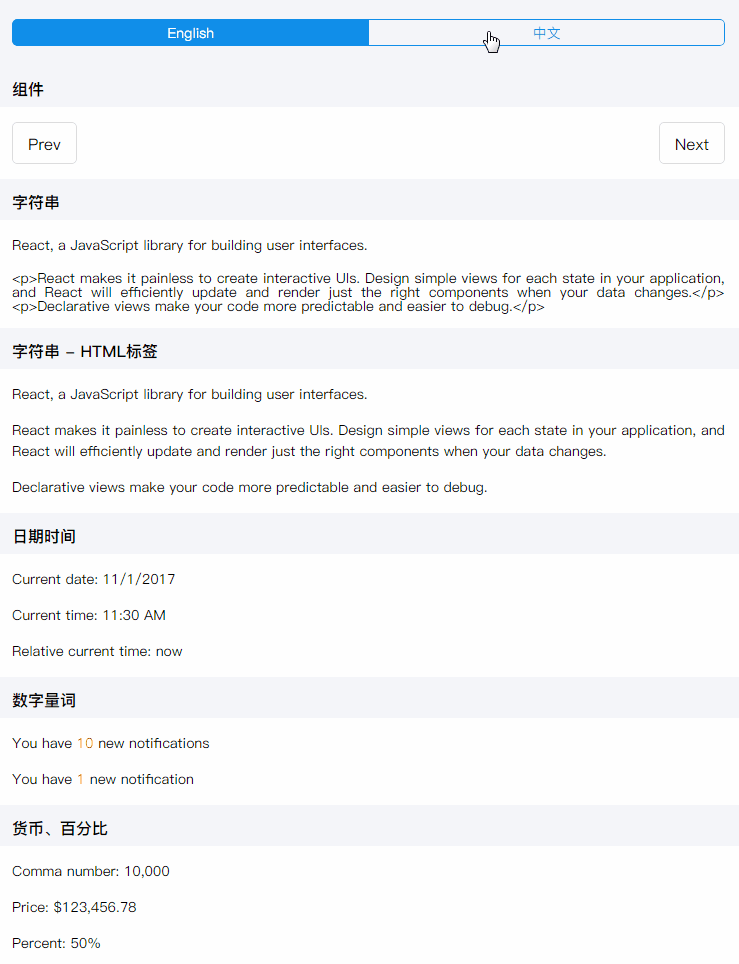

# react-intl-demo
使用 react-intl 实现 React 国际化多语言。


### 运行截图



### 安装与使用

``` 
npm install

npm run dev
```

### 文档
* [Getting Start](docs/getting-start.md)

### 资料
* [Understanding AntD i18n](https://github.com/ant-design/intl-example/blob/master/docs/understanding-antd-i18n.md)
* [Intl.NumberFormat](https://developer.mozilla.org/zh-CN/docs/Web/JavaScript/Reference/Global_Objects/NumberFormat)